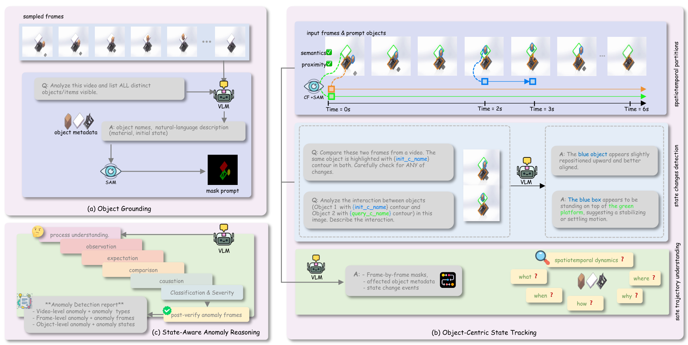

# O-VAD: Industrial Video Anomaly Detection through Object-Centric Tracking and Reasoning

### [Project Page](https://o-vad.github.io/) | [Paper](https://arxiv.org/abs/2607.18142) | [Code](https://github.com/o-vad/O_VAD)

Official implementation of the ECCV 2026 paper *"O-VAD: Industrial Video Anomaly Detection through Object-Centric Tracking and Reasoning"*.

O-VAD is a **training-free agentic framework**. It requires no fine-tuning, no domain-knowledge injection, and no predefined anomaly taxonomy. Instead of predicting a binary normal/abnormal label, it reasons about **object state evolution** and emits a structured report naming the abnormal object, the frames where the anomaly occurs, its type and severity, and a causal explanation.



*<b>(a) Object Grounding</b> — a VLM lists the distinct objects in the scene and describes their material and initial state; SAM turns those phrases into a first-frame mask prompt. <b>(b) Object-Centric State Tracking</b> — CropFormer + SAM build spatiotemporal partitions, held together by semantic and proximity constraints, and a VLM labels the state changes and interactions between them. <b>(c) State-Aware Anomaly Reasoning</b> — a chain of thought runs from process understanding through observation, expectation, comparison and causation to classification and severity, with a post-verification pass over the candidate anomaly frames, producing a report at the video, frame and object level.*

> O-VAD's Stage 2 is built on [TubeletGraph](https://github.com/YihongSun/TubeletGraph) (NeurIPS 2025). This repository carries only the parts of it that O-VAD executes; for VOST/VSCOS/M³-VOS tracking evaluation, see the upstream repository. This file is the complete O-VAD guide.

---

## Table of Contents

1. [Pipeline Overview](#1-pipeline-overview)
2. [Installation](#2-installation)
3. [Data Preparation](#3-data-preparation)
4. [Configuration (required edits)](#4-configuration-required-edits)
5. [Running Inference](#5-running-inference)
6. [Outputs](#6-outputs)
7. [Evaluation](#7-evaluation)
8. [Running on Your Own Video](#8-running-on-your-own-video)
9. [Repository Map](#9-repository-map)
10. [Citation](#10-citation)

---

## 1. Pipeline Overview

O-VAD runs **ground → track → reason**. Each stage writes to disk, so a crashed run resumes from the last completed stage rather than restarting.

| Stage | What it does | Models | Code |
|:--|:--|:--|:--|
| **1. Object Grounding** | A VLM enumerates the objects in the scene as a structured inventory; SAM3 converts each text prompt into a first-frame mask. A second VLM call produces a temporal caption and a recommended FPS (2–10) for Stage 2. | VLM + SAM3 | [annotate/vlm_mask_grounded.py](annotate/vlm_mask_grounded.py) |
| **2. Object-Centric State Tracking** | Builds spatiotemporal tubelets from the Stage 1 masks, keeping identity through deformation, splitting, and occlusion via spatial proximity + CLIP semantic consistency. A VLM labels state-change events on the resulting graph. | CropFormer + SAM2 + FC-CLIP + VLM | [TubeletGraph/run.py](TubeletGraph/run.py), [TubeletGraph/vlm/prompt_vlm.py](TubeletGraph/vlm/prompt_vlm.py) |
| **3. State-Aware Reasoning** | Six-step chain-of-thought over the state graph (observation → expectation → comparison → causation → classification → severity), separating *expected process actions* from *failure outcomes*, with confidence-gated visual verification. | VLM | [TubeletGraph/vlm/prompt_vad.py](TubeletGraph/vlm/prompt_vad.py) |

The three stages are orchestrated by [pipeline.py](pipeline.py), which handles video decoding, VQA-file filtering, dynamic FPS, scratch cleanup, and report writing. One driver serves all benchmarks: everything dataset-specific (on-disk layout, storage-path anchoring, sample discovery, grounding prompts) lives in a `DatasetAdapter` subclass selected by `--dataset`.

---

## 2. Installation

Tested with `python=3.10`, `torch==2.7.0+cu126`, `torchvision==0.22.0+cu126` on a 4×A40 node. A single GPU with ≥24 GB is sufficient when using the OpenAI backbone; the local Qwen backbone additionally needs GPU capacity for the vLLM server, which you run separately.

### 2.1 Environment and core dependencies

```bash
git clone --recurse-submodules https://github.com/o-vad/O_VAD.git
cd O_VAD

conda create -n ovad python=3.10 -y
conda activate ovad

pip install torch==2.7.0 torchvision==0.22.0 --index-url https://download.pytorch.org/whl/cu126
pip install -r requirements.txt
bash thirdparty/setup_ckpts.sh    # downloads CropFormer / SAM2.1 / FC-CLIP weights into ./_ckpts
```

> If you already cloned without `--recurse-submodules`, run `git submodule update --init --recursive`.

### 2.2 SAM2 (tracking backbone, Stage 2)

```bash
cd thirdparty/sam2
pip install -e .
pip install -e ".[notebooks]"
python setup.py build_ext --inplace
cd ../..
```

### 2.3 SAM3 (text-prompted grounding, Stage 1)

Stage 1 imports `sam3.model_builder`, so SAM3 must be installed as a package and you must be logged in to Hugging Face to pull its weights.

```bash
cd thirdparty/sam3
pip install -e .
cd ../..

pip install huggingface_hub
huggingface-cli login    # accept the SAM3 model licence on the Hub first
```

### 2.4 CropFormer / detectron2 (entity segmentation, Stage 2)

```bash
cd thirdparty
git clone https://github.com/facebookresearch/detectron2.git
python -m pip install -e detectron2 --no-build-isolation
ln -s "$(pwd)"/Entity/Entityv2/CropFormer detectron2/projects/CropFormer
cd detectron2/projects/CropFormer/mask2former/modeling/pixel_decoder/ops
bash make.sh
cd ../../../../../../../..
# conda install -c conda-forge libstdcxx-ng   # only if a libstdc++ version mismatch occurs
```

### 2.5 FC-CLIP (semantic consistency, Stage 2)

```bash
cd thirdparty/fc-clip
pip install -r requirements.txt
cd ../..
```

### 2.6 VLM backend

**Option A — OpenAI API (default, used for all reported results):**

```bash
export OPENAI_API_KEY="sk-..."   # add to ~/.bashrc to persist
```

**Option B — local Qwen3-VL:** no extra client-side packages. You run an OpenAI-compatible server (vLLM) in a separate environment and point the pipeline at it — see [§4.3](#43-vlm-backbone).

### 2.7 Optional: evaluation extras

`eval/eval_bert.py` and the BERT-score branch of `eval/eval_general.py` need embedding models that are not in `requirements.txt`:

```bash
pip install sentence-transformers   # for --model sbert (default)
pip install transformers            # for --model bert
```

### 2.8 Verify the install

```bash
python -c "import torch, sam2; from sam3.model_builder import build_sam3_image_model; print('ok', torch.cuda.is_available())"
ls _ckpts   # expect CropFormer_hornet_3x_03823a.pth, sam2.1_hiera_large.pt, fcclip_cocopan.pth
```

---

## 3. Data Preparation

O-VAD is evaluated on three benchmarks. Each needs (a) the videos and (b) a **VQA JSONL** file supplying ground truth and the split assignment.

> **Naming note:** the dataset called **LiquidAD** in the paper and on the project page is referred to as **AutoLab** throughout this codebase (`--dataset autolab`). They are the same data.

### 3.1 Phys-AD (22 object categories)

```bash
unzip Phys_AD_Data_part_0000_of_0006.zip -d Phys-AD
```

Expected layout: `Phys-AD/<category>/<split>/<anomaly_type>/<id>.mp4`, e.g. `Phys-AD/ball/test/insufficient_gas/0008.mp4`.

### 3.2 IPAD (16 scenes, synthetic + real)

```bash
pip install gdown
gdown 1kuNG0OaNJnji1y122q3gxy7SF7iXABV4
unzip IPAD_dataset.zip -d IPAD
```

Expected layout: `IPAD/IPAD_dataset/<subject>/<split>/frames/<seq>`, e.g. `IPAD/IPAD_dataset/R01/testing/frames/02`.

### 3.3 AutoLab / LiquidAD (8 pipette types)

Download the latest release, which carries pipette-level labels alongside the VQA data.

Expected layout: `AutoLab/<split>/<subset>/`, e.g. `AutoLab/test/abnormal_1/`.

> If any archive extracts into an unexpected nesting, move the directories so they match the layouts above — the pipeline resolves samples by walking these paths.

### 3.4 VQA files

Each dataset ships a `*_VQA.jsonl` (one JSON object per line). These files drive video discovery, split filtering, and evaluation:

```json
{"video_path": "/abs/path/Phys-AD/ball/test/insufficient_gas/0008.mp4",
 "org_split": "test",
 "answer": "Abnormal",
 "context": "insufficient_gas"}
```

| Field | Meaning |
|:--|:--|
| `video_path` | Absolute path to the video / frame directory. **Must be rewritten to your local paths** (see [§4.1](#41-rewrite-data-paths-in-the-vqa-files)). |
| `org_split` | Split tag matched against `--split` (default `test`). |
| `answer` | `"Normal"` or `"Abnormal"` — video-level ground truth. |
| `context` | Per dataset: Phys-AD → anomaly-type string (or `"normal"`); IPAD → per-frame 0/1 list; AutoLab → `[start_frame, end_frame]` closed interval. |

---

## 4. Configuration (required edits)

Four things must be adapted before the first run. Steps 4.1 and 4.2 are **mandatory** — the shipped values point at the authors' cluster.

### 4.1 Rewrite data paths in the VQA files

Every `video_path` in the VQA JSONL must resolve on your machine:

```bash
sed -i 's#/work/nvme/bgiv/username/datasets#/your/data/root#g' PhysAD_VQA.jsonl
```

### 4.2 Set the output roots in the pipeline

[pipeline.py](pipeline.py) hardcodes three stage roots near the top of the file:

```python
STAGE1_ROOT = Path("/work/nvme/bgiv/username/stage1")   # grounding masks
STAGE2_ROOT = Path("/work/nvme/bgiv/username/stage2")   # tubelets + state graphs
STAGE3_ROOT = Path("/work/nvme/bgiv/username/stage3")   # anomaly reports
```

Point these at fast local storage — Stage 2 writes per-frame tubelet data and is I/O heavy:

```bash
grep -n "STAGE._ROOT = Path" pipeline.py
```

### 4.3 VLM backbone

O-VAD uses **one VLM for all three stages** — grounding, state tracking and reasoning. Whichever backbone you pick, every stage uses that same model and endpoint; a mixed run is not reachable through `pipeline.py`.

| Backbone | `--vlm` | Talks to | Needs |
|:--|:--|:--|:--|
| **OpenAI API** | `openai` | `api.openai.com`, using `vlm.openai_model` (default `gpt-5.2`). Used for all reported results. | `OPENAI_API_KEY` |
| **Qwen3-VL (local)** | `qwen` | An OpenAI-compatible server you run, e.g. vLLM | GPU(s) for the server |

Both speak the same OpenAI protocol, so the pipeline holds a single client and only the endpoint differs — no in-process model loading, and no `transformers` on the client side.

Configure both backbones in [configs/default.yaml](configs/default.yaml) — one key each:

```yaml
vlm:
  openai_model: gpt-5.2                 # used when --vlm openai
  base_url: http://127.0.0.1:8000/v1    # used when --vlm qwen
```

`base_url` is read **only** by the qwen backbone, so leaving it set does not affect `--vlm openai`. For `--vlm qwen` the model name comes from the server's own `/v1/models`, so there is no second value to keep in sync.

#### Option A — OpenAI (default)

```bash
export OPENAI_API_KEY="sk-..."

python pipeline.py analyze /data/Phys-AD/ball --dataset physad \
    -c configs/default.yaml \
    --vqa_file /data/vqa_data/PhysAD_VQA.jsonl \
    --vlm openai --fps 3 --sample_interval 60 --split test
```

All three stages run on `gpt-5.2`. To use a different OpenAI model, change `vlm.openai_model` — that one key moves all three stages together.

#### Option B — local Qwen3-VL via vLLM

Install vLLM in a **separate environment** (it pins its own torch, which will fight the SAM2/CropFormer stack), then serve the model:

```bash
# in a separate env / on a separate node
pip install vllm
vllm serve Qwen/Qwen3-VL-32B-Instruct --port 8000 \
    --limit-mm-per-prompt '{"image": 16}' --max-model-len 32768
```

> `--limit-mm-per-prompt` is **required**: vLLM allows only one image per request by default, while Stage 1 sends up to 8 caption frames in one call and Stage 3's visual verification sends considerably more. Without it those requests fail.

Then point the pipeline at it and select the backbone:

```bash
python pipeline.py analyze /data/Phys-AD/ball --dataset physad \
    -c configs/default.yaml \
    --vqa_file /data/vqa_data/PhysAD_VQA.jsonl \
    --vlm qwen --fps 3 --sample_interval 60 --split test
```

`$OVAD_VLM_BASE_URL` overrides `vlm.base_url` if you would rather not edit the config:

```bash
export OVAD_VLM_BASE_URL=http://127.0.0.1:8000/v1
python pipeline.py ... --vlm qwen
```

`pipeline.py` resolves the endpoint once and exports it to Stages 2 and 3, which run as separate processes — so they cannot drift onto a different model. It prints the resolved choice at startup:

```
[VLM] backbone=qwen  model=Qwen3-VL-30B-A3B-Instruct  endpoint=http://127.0.0.1:8000/v1  (all three stages)
```

If `--vlm qwen` is passed with no server configured, the run stops immediately with instructions rather than failing per sample.

> **Reproducing the paper:** all reported numbers used the OpenAI backbone (`base_url` unused). The Qwen path is provided for local/offline inference and was not used for published results.

**Known limitation of the Qwen backbone.** `locate_group_bbox` (used only by `--dataset autolab`, to crop around the pipettes before segmenting) asks the VLM for a bounding box. Qwen3-VL returns coordinates in its own internally-resized image space rather than the requested normalized grid, so the box is rejected and Stage 1 falls back to segmenting the full frame. Detection and all other stages are unaffected; AutoLab on the Qwen backbone simply loses the crop optimisation.

### 4.4 Model checkpoints (optional)

`configs/default.yaml` also holds the CropFormer / SAM2.1 / FC-CLIP weight paths (`./_ckpts/...`), tubelet thresholds, and the `Ours_abl_*` ablation variants (proximity constraint off, semantic constraint off, both off). Defaults reproduce the paper.

---

## 5. Running Inference

One driver serves every benchmark:

```
python pipeline.py analyze <ROOT> --dataset <NAME> -c <CONFIG> --vqa_file <JSONL> [options]
```

`<ROOT>` is searched recursively; discovered samples are then filtered by `--split` and by membership in `--vqa_file`. Point it at the dataset root or at a single category to process a subset. Samples whose report already exists are skipped, so an interrupted run resumes where it stopped.

### 5.1 Per-dataset commands

**Phys-AD**

```bash
python pipeline.py analyze /data/Phys-AD/ball --dataset physad \
    -c configs/default.yaml \
    --vqa_file /data/vqa_data/PhysAD_VQA.jsonl \
    --vlm openai --fps 3 --sample_interval 60 \
    --split test
```

**IPAD**

```bash
python pipeline.py analyze /data/IPAD/IPAD_dataset/S04 --dataset ipad \
    -c configs/default.yaml \
    --vqa_file /data/vqa_data/IPAD_VQA.jsonl \
    --vlm openai --fps 3 --sample_interval 25 \
    --split test
```

**AutoLab / LiquidAD**

```bash
python pipeline.py analyze /data/AutoLab/test/abnormal_1 --dataset autolab \
    -c configs/default.yaml \
    --vqa_file /data/AutoLab/autolab.jsonl \
    --dataset_root /data/AutoLab \
    --vlm openai --fps 3 --sample_interval 60 \
    --split test
```

### 5.2 CLI reference

| Flag | Default | Notes |
|:--|:--|:--|
| `analyze <ROOT>` | — | Positional. Root directory searched recursively for samples. |
| `--dataset` | *required* | `physad` \| `ipad` \| `autolab`. Selects the layout, discovery rule and grounding behaviour. |
| `-c, --config` | *required* | Path to `configs/default.yaml`. |
| `--vqa_file` | *required* | Ground-truth JSONL; also acts as the sample allow-list. |
| `--split` | `test` | Matched against `org_split` in the VQA file (case-insensitive). |
| `--vlm` | `openai` | Backbone for **all three stages**: `openai` \| `qwen`. Authoritative — nothing in the config needs to match it. See [§4.3](#43-vlm-backbone). |
| `--fps` | `None` | **Fallback** FPS for Stage 2, used only when the VLM-recommended FPS is unavailable. `3` is the reported setting. |
| `--sample_interval` | `10` | Frame stride for state-change detection. Reported: `60` (Phys-AD, AutoLab), `25` (IPAD). |
| `--method` | `Ours` | Method key from `configs/default.yaml`; switch to `Ours_abl_*` for ablations. |
| `--dataset_root` | inferred | **AutoLab only.** Resolves the relative `video_path` values in its VQA file. Defaults to the `AutoLab/` component of `<ROOT>`. |
| `-o, --output` | `output` | Legacy flag — real outputs go to the `STAGE*_ROOT` paths from [§4.2](#42-set-the-output-roots-in-the-pipeline). |
| `--no-auto` | off | Disables automatic object detection in Stage 1. |
| `-v, --verbose` | off | Per-stage progress and the exact stage commands. |

**Tuning flags** — the defaults reproduce the per-dataset behaviour of the original drivers, so you only need these when deviating:

| Flag | Default | Notes |
|:--|:--|:--|
| `--runner` | `inprocess` for `physad`, `subprocess` otherwise | How Stages 2/3 are launched. `inprocess` keeps loaded models (Qwen weights, SAM3) shared across stages instead of re-importing per sample; `subprocess` isolates them so a stage crash cannot take down the run. |
| `--mask-frame-mode` | `best` for `autolab`, `first` otherwise | Which frame the Stage 1 mask is anchored to. `first` always uses frame 0; `best` uses the highest-coverage scanned frame and forwards it to Stage 2 as `--mask_frame_id`. |
| `--max-retries` | `100` | Attempts per stage before a sample is marked failed. Each failure sleeps 3 s, so a broken environment takes ~5 min per sample to give up — lower this while debugging. |
| `--keep-scratch` | off | Retain `_custom_dataset/`, `_interm_out/`, `_pred_out/` for inspection instead of cleaning them per sample. |
| `--sample_id_s` / `--sample_id_e` | `None` | Shard the discovered sample list — see [§5.3](#53-parallel-sharding). |

### 5.3 Parallel sharding

`--sample_id_s` / `--sample_id_e` slice the discovered sample list, so a run can be split across jobs or GPUs:

```bash
python pipeline.py analyze /data/Phys-AD/caster_wheel --dataset physad \
    -c configs/default.yaml \
    --vqa_file /data/vqa_data/PhysAD_VQA.jsonl \
    --vlm openai --fps 3 --sample_interval 60 \
    --split test \
    --sample_id_s 0 --sample_id_e 10
```

Launch several jobs with disjoint `[--sample_id_s, --sample_id_e)` ranges pointing at the same `STAGE*_ROOT`; the outputs merge on disk. The slice is applied **after** VQA and split filtering, so equal-width ranges give equal-sized shards. Overlapping ranges are safe too — a sample whose report already exists is skipped.

### 5.4 Cluster submission

[run_pipe.slurm](run_pipe.slurm) is a SLURM template (A40 partition, 20 h, 1 GPU, 8 CPUs). Update the account, conda path and working directory before submitting:

```bash
sbatch run_pipe.slurm
```

> ⚠️ Export `OPENAI_API_KEY` from your shell profile or a secrets file. Never write a real key into the batch script — it ends up in git history.

---

## 6. Outputs

Stage outputs mirror the dataset's directory structure under each root:

```
$STAGE1_ROOT/PhysAD/ball/test/insufficient_gas/0008_mask/0000000.png   # grounding masks
$STAGE2_ROOT/PhysAD/ball/test/insufficient_gas/0008/                   # tubelets + state graph
$STAGE3_ROOT/PhysAD/ball/test/insufficient_gas/0008_report.json        # anomaly report
```

Nothing is written into the repository itself: local scratch dirs (`_custom_dataset/`, `_interm_out/`, `_pred_out/`) are created under the project root and cleaned per sample once the stage data is safely written (`--keep-scratch` retains them). Frames are staged in `$TMPDIR` and never copied to the storage roots.

Each report is a structured JSON document:

```json
{
  "video_name": "IPAD-01",
  "anomaly_detected": true,
  "num_anomalies": 1,
  "overall_severity": "high",
  "anomalies": [{
    "anomaly_type": "process_anomaly",
    "anomaly_subtype": "disappearance",
    "severity": "critical",
    "description": "The cardboard box disappeared between frames 190-200 ...",
    "affected_objects": ["3"],
    "start_frame": 190,
    "end_frame": 200,
    "confidence": 0.85,
    "reasoning_trace": {
      "step1_observation": "...", "step2_expectation": "...",
      "step3_comparison":  "...", "step4_causation":   "...",
      "step5_classification": "...", "step6_severity":  "..."
    }
  }]
}
```

`*_report.json` is the only artefact Stage 3 writes; the formatted report is also printed to stdout (visible with `-v`). To confirm your install produces well-formed output, check that the first report contains a non-empty `anomalies[].reasoning_trace` with all six steps populated — an empty `anomalies` list with `"overall_severity": "N/A"` means Stage 3 produced no parseable report and the fallback stub was written instead.

---

## 7. Evaluation

### 7.1 Detection metrics

[eval/eval_general.py](eval/eval_general.py) scores a directory of reports against a VQA file:

```bash
python eval/eval_general.py \
    --dataset physad \
    --vqa  /data/vqa_data/PhysAD_VQA.jsonl \
    --reports $STAGE3_ROOT/PhysAD
```

| `--dataset` | Metrics reported |
|:--|:--|
| `physad` | Video-level Accuracy / Precision / Recall / F1 / AUROC + BERT score |
| `ipad` | Video-level 5 metrics + frame-level Acc / P / R / F1 / AUROC |
| `autolab` | Video-level 5 metrics + frame-level metrics (GT `[start, end]` span expanded per frame) |

`--reports` is searched recursively for `*_report.json`. Reports are matched to VQA entries by normalising the video path into the report's `video_name` (e.g. `/…/IPAD_dataset/R01/testing/frames/02` → `R01_testing_frames_02`), so a report with an unexpected `video_name` will silently go unmatched — check the reported entry count.

Frame-level prediction marks a frame abnormal if it lies inside any predicted `[start_frame, end_frame]` interval; AUROC uses the continuous confidence score.

### 7.2 Description quality (Sentence-BERT)

[eval/eval_bert.py](eval/eval_bert.py) measures semantic similarity between the predicted anomaly type/subtype and the ground-truth context, per Phys-AD subset:

```bash
python eval/eval_bert.py \
    --outputs $STAGE3_ROOT/PhysAD \
    --vqa /data/vqa_data/PhysAD_VQA.jsonl \
    --model sbert          # sbert = all-MiniLM-L6-v2 (default) | bert = bert-base-uncased CLS
```

`--outputs` accepts either a directory of per-sample JSON files or a single JSON list.

### 7.3 Reference results

| Benchmark | Video AUROC |
|:--|:--|
| Phys-AD | 0.584 (1st/2nd place on 16 of 22 categories) |
| LiquidAD / AutoLab | 0.692 |
| IPAD | 0.565 (1st/2nd place on 12 of 16 scenes) |

Because every stage queries a VLM, minor run-to-run variance is expected even at temperature 0.

---

## 8. Running on Your Own Video

For a single video with no VQA file, run **Stage 2** directly through [quick_run.py](quick_run.py), supplying the first-frame mask yourself:

```bash
python quick_run.py \
    --input_dir  <FRAME_DIR>        \
    --input_mask <FIRST_FRAME.png>  \
    --fps 30 --vlm_model openai   # openai | qwen, same choice as --vlm
```

- `--input_dir`: directory of frames named `0000000.jpg, 0000001.jpg, …`
- `--input_mask`: PNG whose pixel values are object IDs (`0` = background, `1..N` = objects, `255` = ignore)
- `--mask_frame_id`: frame the mask corresponds to, if not frame 0
- `--hint_str`: optional scene hint passed to the VLM

This stops after the state graph. To get an anomaly report, run Stage 3 on the result:

```bash
python TubeletGraph/vlm/prompt_vad.py \
    -c configs/default.yaml -p <FRAME_DIR_NAME> \
    --video_path <FRAME_DIR> --vlm openai \
    --output_dir output/anomaly_reports --detect_anomalies
```

To generate the mask automatically instead of drawing it, call the Stage 1 grounding module directly — [annotate/vlm_mask_grounded.py](annotate/vlm_mask_grounded.py) exposes `SAM3Segmenter`, which turns VLM-produced object phrases into masks.

For a full custom **dataset**, write a VQA JSONL matching [§3.4](#34-vqa-files) and add a `DatasetAdapter` subclass to [pipeline.py](pipeline.py) — subclass it, set `kind` (`"video"` for `.mp4` samples or `"sequence"` for frame directories), implement `unique_stem` and `nvme_rel` for your layout, and register it in the `ADAPTERS` dict. Override `discover`, `grounding_objects` or `resolve_normal_reference` only if your layout needs them; the base class covers the common case. Alternatively, add a block under `datasets:` in `configs/default.yaml` (`data_dir`, `image_dir`, `anno_dir`, `split_dir`, `image_format`, `anno_format`, `fps`) and drive the tracking stage directly with `TubeletGraph/run.py`.

---

## 9. Repository Map

Files on the O-VAD execution path are marked ★.

```
.
├── pipeline.py            ★ unified 3-stage driver (--dataset physad|ipad|autolab)
├── quick_run.py           ★ Stage 2 driver: frames + first-frame mask → state graph
├── utils.py               ★ shared config / mask / IO helpers
├── annotate/
│   └── vlm_mask_grounded.py   ★ Stage 1: VLM grounding + SAM3 segmentation
├── TubeletGraph/
│   ├── run.py                 ★ Stage 2 orchestrator (spawns the four steps below)
│   ├── entity_segmentation/cropformer.py   ★
│   ├── tubelet/compute_tubelets_sam.py     ★
│   ├── semantic_sim/compute_sim_fcclip.py  ★
│   ├── get_prediction.py                   ★
│   ├── tracker/{__init__,sam2,ours}.py     ★
│   └── vlm/
│       ├── prompt_vlm.py      ★ Stage 2: object state tracking
│       └── prompt_vad.py      ★ Stage 3: reasoning + report generation
├── eval/
│   ├── build_custom_dataset.py ★ called by quick_run.py
│   ├── eval_general.py          detection metrics (video- and frame-level)
│   └── eval_bert.py             Sentence-BERT description scoring
├── configs/default.yaml     ★ models, thresholds, dataset paths, VLM choice
├── thirdparty/              ★ sam2, sam3, Entity/CropFormer, fc-clip, setup_ckpts.sh
└── run_pipe.slurm             SLURM template
```

Running the pipeline creates `_custom_dataset/`, `_interm_out/`, `_pred_out/` and `splits/custom/` under the project root as transient scratch, all cleaned per sample. Every persistent artefact lands under `STAGE1_ROOT` / `STAGE2_ROOT` / `STAGE3_ROOT` ([§6](#6-outputs)).

---


## 10. Citation

If you find our work useful, please cite:

```bibtex
@article{yuan2026vad,
  title={O-VAD: Industrial Video Anomaly Detection through Object-Centric Tracking and Reasoning},
  author={Yuan, Mei and Long, Qi and Wu, Qifeng and Li, Zhenyang and Zhao, Yizhou and Wang, Lei and Liu, Yang and Xu, Min},
  journal={arXiv preprint arXiv:2607.18142},
  year={2026}
}
```

O-VAD builds on TubeletGraph — please also cite:

```bibtex
@article{sun2025tracking,
  title={Tracking and Understanding Object Transformations},
  author={Sun, Yihong and Yang, Xinyu and Sun, Jennifer J and Hariharan, Bharath},
  journal={Advances in Neural Information Processing Systems},
  year={2025}
}
```

## Acknowledgements

This project builds on [TubeletGraph](https://github.com/YihongSun/TubeletGraph), [SAM 2](https://github.com/facebookresearch/sam2), [SAM 3](https://github.com/facebookresearch/sam3), [CropFormer / Entity](https://github.com/qqlu/Entity), [FC-CLIP](https://github.com/bytedance/fc-clip), and [detectron2](https://github.com/facebookresearch/detectron2). We thank the authors for releasing their code.
